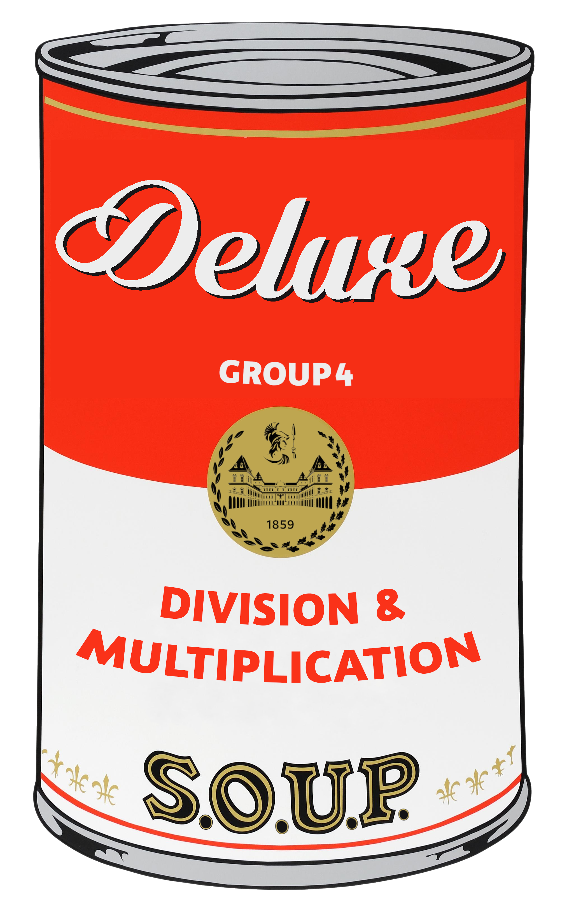
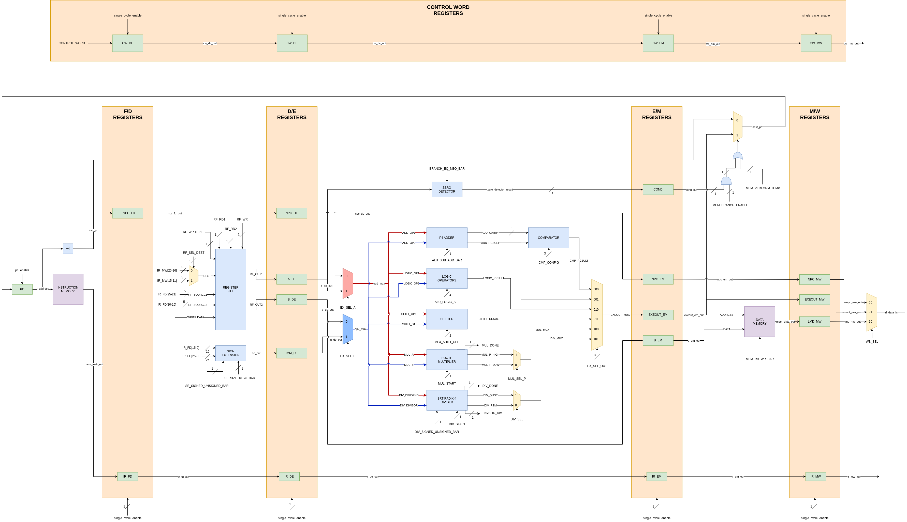
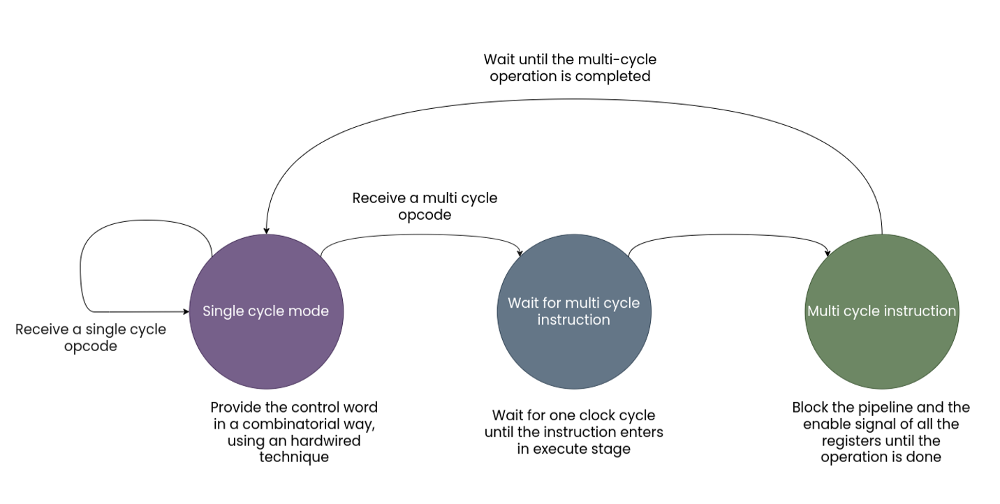

# SOUP - a ***S**oup*er **U**nbeatable **O**ptimized **P**rocessor

## Logo

## Authors

- Sansone Giacomo, [pcineverdies](https://github.com/pcineverdies)
- Silvestri Giuseppe, [SinisterXV](https://github.com/SinisterXV)
- Valenza Arianna, [ariannavalenza](https://github.com/ariannavalenza)

## What it is

This is a VHDL implementation of the RISC DLX cpu, originally developed by Hennessy and Patterson. 
The steps for its development were:

- Design
- Coding
- Simulation and verification
- Synthesis
- Place and Route

### Why it is a pro version

We decided to implement the multiplication and division instructions. Both the instructions are multi-cycle, this required a modification of the controller and the registers of the pipeline.

The multiplication is implemented using the booth algorithm, in its radix-4 version. 

The division is implemented using a radix-4 SRT algorithm with minimum redundant digit-set. 
This is the same algorithm which failed in the FPU of Pentium processors in 1994.
Since there was available *simple* documentation about this algorithm, we wrote it by ourselves. 

We implemented other simple instructions which were not required for the base version of the cpu (xnor, xnori, nand, nandi, nor, nori, sgt, sgti, slt, slti, ret).

Our simulation environment is fully automatized, as it will be further explained.

## Datapath

Here is an image of the datapath. The complete overview of the components and some insights about the design choices can be found in the documentation. 

## Controller

Here is an overview of the controller, designed as an hybrid between an FSM and an hardwired

## ISA

A complete overview of the ISA can be found [here](doc/ISA.md).

## Simulation

The simulation environment is explained [here](sim/README.md).

## Synthesis

The synthesis environment is explained [here](syn/README.md).
